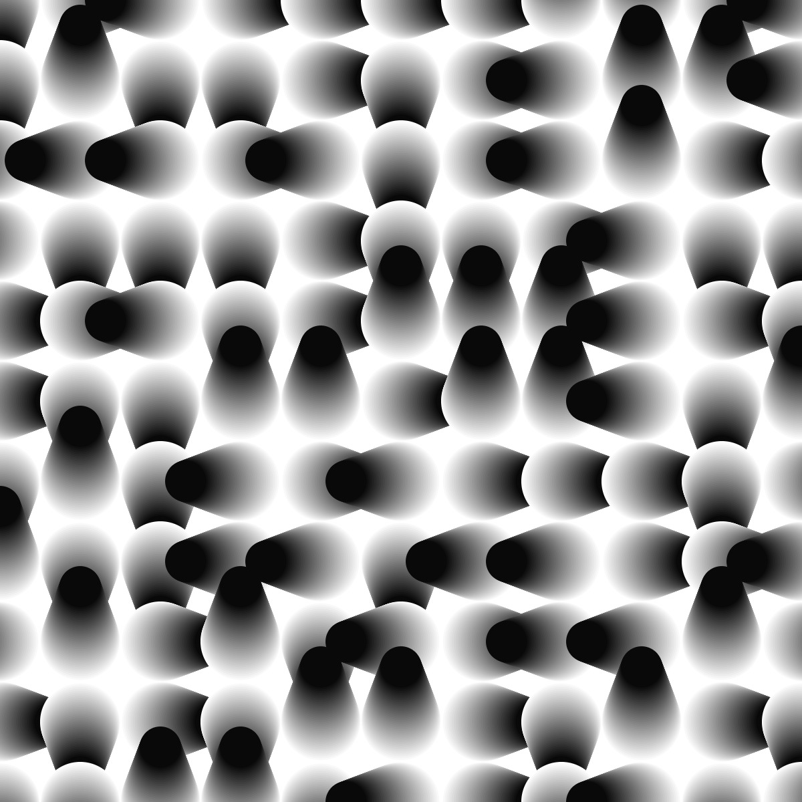

# Week 1 — Grid Systems & Directional Distortion

## Exploration

This week I explored how simple grids can be disrupted through directional
movement and iterative drawing, based on the Generative Gestaltung sketch
**P_2_1_3_05**. Instead of using modular rules or randomness applied to color or
shape choice, this system generates variation through _repetition and
displacement_.

I built a grid where each cell becomes the origin for a stack of circles. Each
circle in the stack shifts slightly in one of four cardinal directions:
left, right, up, or down. The direction is re-randomized every time I click,
leading to a broad variety of emergent patterns.


<iframe src="code/00/embed.html" width="100%" height="450" frameborder="no"></iframe>
  

The biggest challenge was finding the right balance between structure and
movement. If the displacement is too strong, the grid dissolves; too subtle, and
the drawing becomes static.

## References

- Vera Molnár, _Des(ordre)_ series (1974)
- Sol LeWitt’s systematic wall drawings and rule-based compositions
- Generative Gestaltung, _P_2_1_3_05_
  [Link to specific artwork]

Like Molnár, I’m interested in how small deviations create expressive visual
systems. Here, the “rules” become directional: each cell chooses a heading, then
executes a controlled drift away from its original position.

## Algorithmic Thinking

The core system:

- Divide the canvas into an X × Y grid
- For each grid cell:

  - Determine a base position `(posX, posY)`
  - Randomly choose a direction `heading ∈ {0,1,2,3}`
  - Draw a stack of circles, increasing displacement one step at a time:

    - Circle size transitions from tile size → a smaller value
    - Color lightens gradually using `colorStep`

- Mouse interaction:

  - `mouseX` controls how many steps each stack takes
  - `mouseY` controls the size of the final circle
  - Clicking reseeds the randomness and reshuffles all directions

```javascript
for each grid cell:
  pick random heading 0–3
  for i in 0..stepSize:
    diameter = map(i, 0, stepSize, tileWidth, endSize)
    draw circle shifted by i in chosen direction
```

This creates a field of directional distortions. Some areas cluster into
streaks; others radiate outward; others collapse inward.

## Reflection



I didn’t expect how strongly the visual character would be influenced by the
mouse-controlled parameters. Moving the mouse horizontally changes the number of
overlapping circles — creating tension between dense and sparse areas. Vertical
movement shifts size, making some regions feel like they’re “fading” while
others appear bold.

The system feels intentional because every variation emerges from a small set of
consistent rules: pick a direction, repeat a process, and scale gradually.

Next week I want to explore:

- Adding color rules instead of grayscale gradients
- Replacing straight-line displacement with noise curves
- Animating the drift so the grid flows over time

**Questions:**
How much directional distortion can a grid sustain while remaining readable?
How can repeated forms create a sense of rhythm across the whole field?
